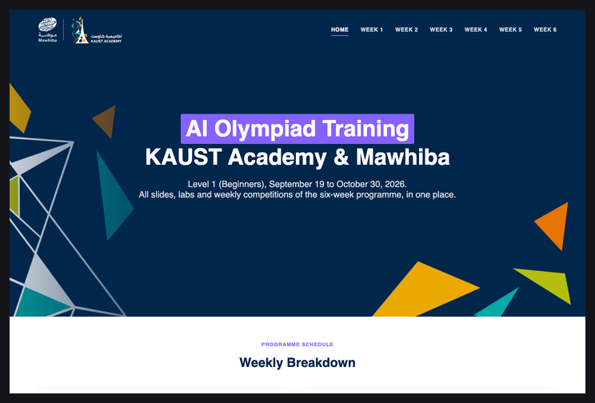

# KAUST Academy & Mawhiba AI Olympiad Training (Beginners)

<picture>
  <source media="(prefers-color-scheme: dark)" srcset="assets/img/banner-dark.png">
  
</picture>

Welcome to the **KAUST Academy & Mawhiba AI Olympiad Training (Beginners)** programme. This repository contains all slides, labs and competition material for the six-week course (September 19 to October 30, 2026) that prepares Grade 8 to 10 students for AI Olympiad competitions: Python and data science, machine learning, neural networks and deep learning, computer vision, transfer learning and embeddings, and natural language processing.

## Course Materials

Access the course content through our GitHub Pages site:

  

<h3 align="center">
  <a href="https://sattamaltwaim.github.io/AI-Olympiad-L1-2026/">
    Access Content Website
  </a>
</h3>

---

## Schedule

The programme runs over six weeks, seven days each. Every week closes with a Coursera exam and a mock Olympiad competition.

| Week | Dates | Topic | Content |
|------|-------|-------|---------|
| Week 1 | September 19 – 25 | Python & DS | [Week 1 Content](https://sattamaltwaim.github.io/AI-Olympiad-L1-2026/week1/) |
| Week 2 | September 26 – October 2 | ML Techniques | [Week 2 Content](https://sattamaltwaim.github.io/AI-Olympiad-L1-2026/week2/) |
| Week 3 | October 3 – 9 | NNs & DL | [Week 3 Content](https://sattamaltwaim.github.io/AI-Olympiad-L1-2026/week3/) |
| Week 4 | October 10 – 16 | CV | [Week 4 Content](https://sattamaltwaim.github.io/AI-Olympiad-L1-2026/week4/) |
| Week 5 | October 17 – 23 | Transfer Learning & Embeddings | [Week 5 Content](https://sattamaltwaim.github.io/AI-Olympiad-L1-2026/week5/) |
| Week 6 | October 24 – 30 | NLP | [Week 6 Content](https://sattamaltwaim.github.io/AI-Olympiad-L1-2026/week6/) |

## License

Licensed under GPL-3.0.

> **Important:** Recording and uploading lectures online is not permitted.
